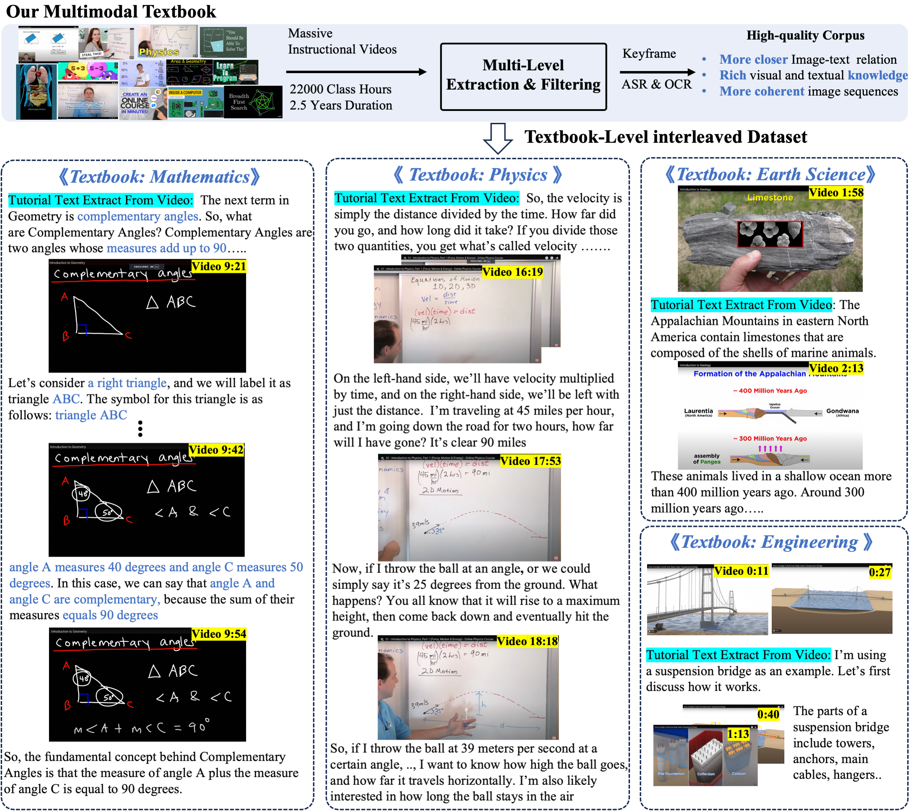

# in-scientific


<video src="https://github.com/user-attachments/assets/204c4985-41fd-456e-8282-e336f2e44f52" width="714" height="480" autoplay loop></video>
   
## News    
🎆 [New 2025018] Multimodal Textbook has more than 8000 downloads on the huggingface dataset.   
🎆 [New 2025015] Multimodal Textbook ranks #2 on Hugginface Weekly Trending.


## Overview

This repository is the official code for ["2.5 Years in Class: A Multimodal Textbook for Vision-Language Pretraining"](https://arxiv.org/abs/2501.00958). It contains the implementation of pre-training LLaVA on our multimodal textbook (interleaved image-text corpora). Our dataset can be found in [Huggingface Dataset](https://huggingface.co/datasets/DAMO-NLP-SG/multimodal_textbook).

- Multimodal Textbook is a high-quality **pre-training corpus** that encompasses a wealth of foundational knowledge, which is presented in an **image-text interleaved format**.
- This textbook is constructed from **2.5 years of instructional videos**, amounting to 22,000 class hours, covering six fundamental subjects, including mathematics, physics, and others. 
- In multimodal textbooks, the text is transcribed from audio, and images are extracted from video's kekframe. They are closely aligned, and provide more coherent context.  
  


  

## 🛠️ Installation

```
cd multimodal_textbook
# create and activate an environment
conda create -n interleaved_textbook python=3.10 -y
conda activate interleaved_textbook

# install package
pip install --upgrade pip  
pip install torch==2.1.2 torchvision==0.16.2 torchaudio==2.1.2 --index-url https://download.pytorch.org/whl/cu118  
pip install -e .
pip install open_flamingo --no-deps
pip install flash-attn --no-build-isolation
```


## Visualize Our Textbook   

Due to the large size of the dataset (our complete textbook dataset is 13GB for JSON files and 0.7TB for images), we sampled 100 samples and the corresponding images and stored them in the `example_data` folder: `./example_data/textbook_sample_100.json`.

Each sample is stored in dict format as follows:
```
[
{'images':  [keyframe1, None, keyframe2, None, keyframe3, None,.....],
 'texts':   [None,      asr1,  None,      asr2, None,     asr3,.....],
 'text_ocr_list':  [None, asr1+ocr1,  None, asr2+ocr2, None, asr3+ocr3,.....],
 'metadata': [...],
 'image_num': 15,
 'text_num': 425,
 'token_num': 9065},
 ....
]
```
Just like [OBELICS](https://github.com/huggingface/OBELICS), the "images" and "texts" are arranged interleavely: 
- "Images" list contains multiple keyframes and "None", where "None" represents that the current position is text. 
- "texts" list contain multiple asr text. The position of "None" in "texts" list is image.
- "text_ocr_list": In addition to asr text, "text_ocr_list" also includes OCR text.
- "image_num", "text_num", "token_num": respectively represent the number of images, the number of asr text tokens, and the estimated total number of tokens in this sample.


To view our dataset more conveniently, we have written a jupyter notebook: `./llava/dataset/show_interleaved_dataset.ipynb`

```
cd example_data
show_interleaved_dataset.ipynb
```
In the notebook, you can see keyframes interleaving with text.


## Data Preparation
- Training Corpus: `multimodal_textbook.json` (11GB) + images folder (700GB)
- Benchmarks: OKVQA, TextVQA, scienceQ, Mathvista, mathvision, mathverse  in `./playground/data/eval/`
 
We provide a ``json file`` and corresponding images folder for textbook with 100 samples in the ``example_data`` folder, which is convenient for debugging. The full version of our dataset can be downloaded on our [Huggingface Dataset](https://huggingface.co/datasets/DAMO-NLP-SG/multimodal_textbook).


### Naming Format  

For each keyframe, its naming format rule is:   
`video id@start-time_end-time#keyframe-number.jpg`.   
For example, the path and file name of a keyframe is   
`-1uixJ1V-As/-1uixJ1V-As@10.0_55.0#2.jpg`.   

This means that this image is extracted from the video (`-1uixJ1V-As`), more specifically, it is the second keyframe (#2) in the video clip from 10.0 to 55.0 seconds. You can access the original video through [https://www.youtube.com/watch?v=-1uixJ1V-As](https://www.youtube.com/watch?v=-1uixJ1V-As).


## 💡 Evaluating with few-shot setting


### Evaluate math-related benchmarks (mathvista, mathvision, mathverse)
- `model_vqa_loader_few_shot_mathvista.py` is used for evaluate the few-shot performance of VLMs on mathvista
- `eval_mathvista.py` is used for scoring the output of VLMs based on labeled answer. We employ gpt4o/deepseek-v2 for evaluating.

```
cd scripts
./mathvista_fewshot.sh
```

Note:
> `model_path` :  The model path that needs to be evaluated.    
`shot`: the number of the examples in prompt.     
`question-file`, `answers-file`, `image-folder` : mathvista's json file and images, The json file is already included in the `playground/data/eval/mathvista`. The complete playground folder (images and json files) can be downloaded on our [Huggingface Dataset](https://huggingface.co/datasets/DAMO-NLP-SG/multimodal_textbook): ./playground.zip.   
`train_image_dir_path`, `train_image_dir_path`: In few-shot scenarios, we retrieve the top-k simliar examples from the training dataset. Since mathvista has no training set, we retrieve it from mathvision.    
`cached_demonstration_features`: the image features of the mathvision which is used for few-shot retrieval.     
`rices`: Whether to use few-shot retrieval.  


If you want to use multiple GPUs to run multiple shot evaluations simultaneously, please use the script `meta_mathvista_fewshot_h100.sh`.


### Evaluate VQA (okvqa, textvqa)
Similarly, `model_vqa_loader_few_shot.py`, `eval_okvqa.py`, and `eval_okvqa.py` are used for evaluating VQA benchmarks.
```
./textvqa_fewshot.sh
```

### Evaluate ScienceQA
```
./scienceQA_fewshot.sh
```

## 🔥 Training

### Pre-training with Llava-1.5
Similart to llava, `./llava/train/train_interleaved.py` is the training script for our textbook pretraining.

```
cd scripts
./run_training.sh
```
Note: 
> data_path: the interleaved dataset in obelics format. You just need to replace the `textbook_sample_100.json` with `multimodal_textbook.json`.
model_max_length: max length    
mmc4_max_num_images: The maximum number of images in the sample. Images exceeding this number will be ignored. 

### Pre-training with Idefics2-base 

If you want to train idefics2 using mmc4 or our textbook, we also provide a script:
```
cd training_idefics
./run.sh
```
Note: this script uses `ours_textbook_video_clip_format.json`, which is different from OBELICS format.


## Citation
If you use our data or code in your research projects, please mention this repo and cite our paper as follows:
```bibtex
@article{zhang20252,
  title={2.5 Years in Class: A Multimodal Textbook for Vision-Language Pretraining},
  author={Zhang, Wenqi and Zhang, Hang and Li, Xin and Sun, Jiashuo and Shen, Yongliang and Lu, Weiming and Zhao, Deli and Zhuang, Yueting and Bing, Lidong},
  journal={arXiv preprint arXiv:2501.00958},
  year={2025}
}
```

## Acknowledgements  
The codebase is based on [LLaVA](https://github.com/haotian-liu/LLaVA) and [OmniCorpus](https://github.com/OpenGVLab/OmniCorpus), Thanks for their great work.
